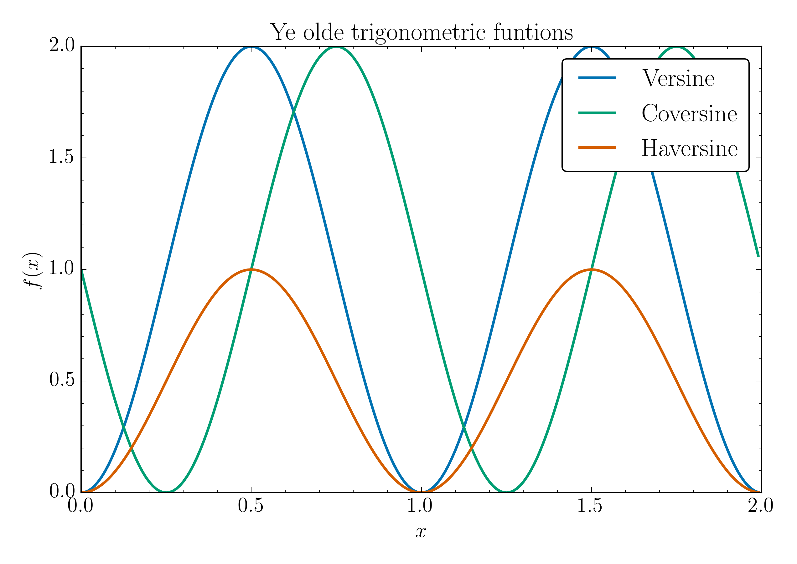
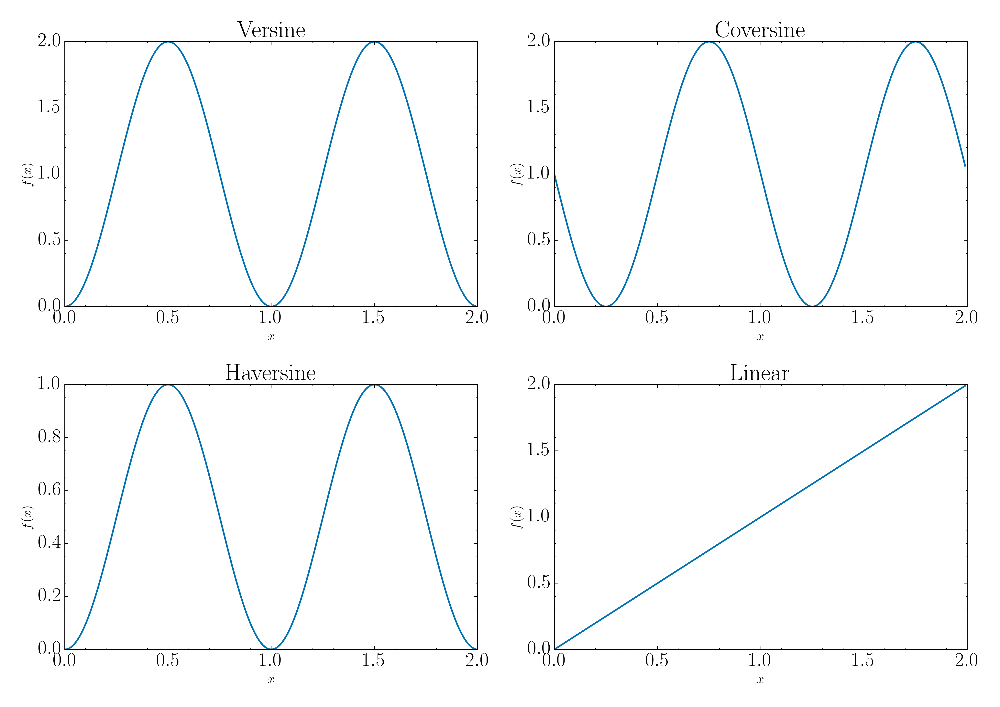

# paper-themes

A simple plot theme for matplotlib I use as a base for scientific publications.

To install it clone or download and run [copy-themes.py](copy-themes.py).
A simple [demo](demo.py) is also provided.
