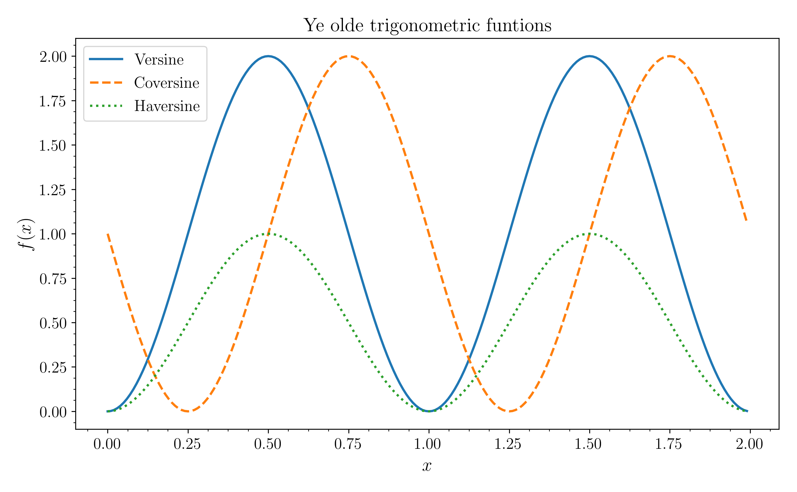
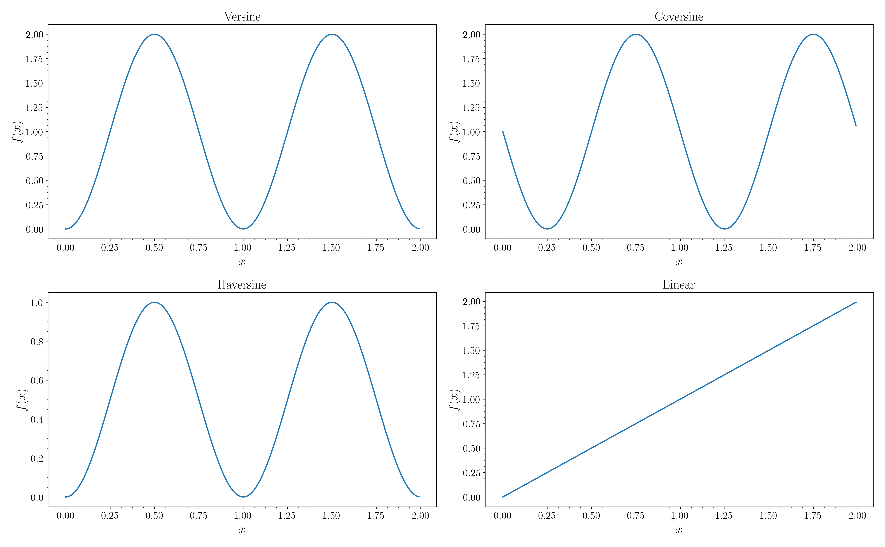

# paper-themes

[](LICENSE)

A simple plot theme for matplotlib I use as a *base* for scientific publications.




To install it clone or download and run [copy-themes.py](copy-themes.py):
```bash
git clone https://github.com/Dih5/paper-themes.git
cd paper-themes && python copy-themes.py
```
A simple [demo](demo.py) is also provided.

## Notes
Supporting additional text packages with the text.latex.preamble option is regarded as dangerous and hence not officially supported. However, consider e.g. using at runtime
```python
matplotlib.rcParams['text.latex.preamble'] = [r'\usepackage{siunitx}']
```
if needed.
